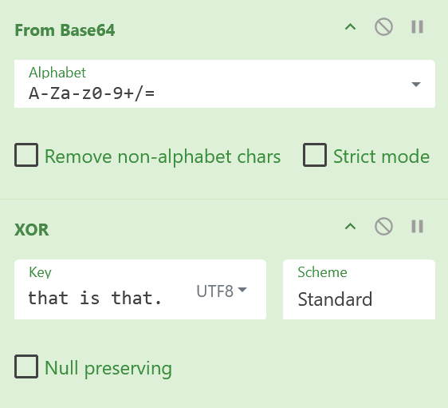

### Gloves of the Black Silence

***Orlando Innamorato***

Though it may hurt today,
tomorrow I'll be heading my way.

***Orlando Furioso***

1. We start by binwalking `Gloves_of_the_Black_Silence.png`, which gives us 9 images (9 pages of the Black Silence).

2. When exiftool is run on each image, there is `hcikey{...}` as the artist on each field. Since it is in base 64 and each image has it, we must recover the full encoded string.

3. Using the order in `orlando.txt`, we rearrange the base64 snippets into one full string: `"Lascia chio pianga mia cruda sorte e che sospiri la liberta"` (Let me weep for my cruel destiny and long for my lost **freedom**.)

4. Using the hint of **freedom**, we use `"Lascia chio pianga mia cruda sorte e che sospiri la liberta"` as the password for the the zip file, `Perception_Blocking_Mask.zip`.

5. The mask is removed, granting us access to two new files, `Furioso.png` and `lacrimosa-crescendo.txt`.

6. Using Strings, we find a sneaky secret payload in `Furioso.png`, which appears to be in Base64:

----BEGIN HCI PAYLOAD----

PAsACGlJG0ECDUkdQ1QJBwpHVAoUAAAECgAHBxMGQSNICB1ESToAAwkHBwxODhoMSRoPQRlPGxYOVCEVVEY1G0kRRQwdDFQBHVNfVAgCCAAdG01URggaVBwOFBgOIAdJHkVHU3ccEUkARE8UAgAAPUgDEUcbBkQTDUEdWnhIGhpOChYAEB0bGkJHQRoMRVQADgFSGlNXHA0PVEMtSBocVQVTQwYdGhtJREEaDEVUDAQEVAEAABsOQRlXdAAMElIdXwAdHEkETVNBHQFBAA0FVFQBFlIRSAMRXT0MDFNNDEwAO0gaHF5SDhlIAD1ICRVWDFNFGgwEEAJ0EQYGABoWRVhICwoMUgQdFEUXHAgaR0kKTwFEQRZLNwkcAEVJOgAVBUkQSVIVDw1OVBEOAQAeGkwYSA8RWDEaSR9FCAVFVAUMXQxhCU9EaVQaBBVMAAlFVAEVTg4tBxwBAAsWQQEcEFNASQQdREkaSBUcRUkVTwYLBFRBMkgQHFUbU0IRAQcUAgA4AREAFRoEVEwAGEVUHAkbXTFIHhtPSR1FAg0bU0BFBxpEVBwNQQdBDVNGHRoEB0cwDUkQTxsdRQZIBhUMTRhOFE8bGkEWTAgQS1QABBVcIEZJPAAECgAHBxsBQ1dNTh1PAUgABkVJEUUAHAQGDiAACB0ACFNXEQQFXk5FDQESRRBSQRZFChJVBw1BPQ4/BgYEAB0bQQBIBh0MVAkLREQVEUEbRkkeWVQOCBpPOEgIFE8HCgxUEQYGDFcIAggAFg1BAEgMAUVYSA0NRzoPSRpOSR5ZVBsBFklUEkJEb1QbDgZSBgQMVBsOVFo8CR1TWQYGABkBDhtYAA4AB0VUCQYVSQdTQQAcBBleIEgdHAAMHVQRGkkeVQAJCwVSAEYc

----END HCI PAYLOAD----

6. The contents of `lacrimosa-crescendo.txt` is **"This is this, and that is that."** This hints towards XOR encryption, thus we try decrypting the payload using the contents of `lacrimosa-crescendo.txt` as the key.

7. We can use cyberchef to decode the payload now. 

**Flag**: `hci{I have nothing but my sorrow and I want nothing more. It has been, it still is, faithful to me. Why should I begrudge it, since during the hours when my soul crushed the depths of my heart, it was seated there beside me? O sorrow, I have ended, you see, by respecting you, because I am certain you will never leave me. Ah! I realize it: your beauty lies in the force of your being. You are like those who never left the sad fireside corner of my poor black heart. O my sorrow, you are better than a well-beloved: because I know that on the day of my final agony, you will be there, lying in my sheets, O sorrow, so that you might once again attempt to enter my heart.}`